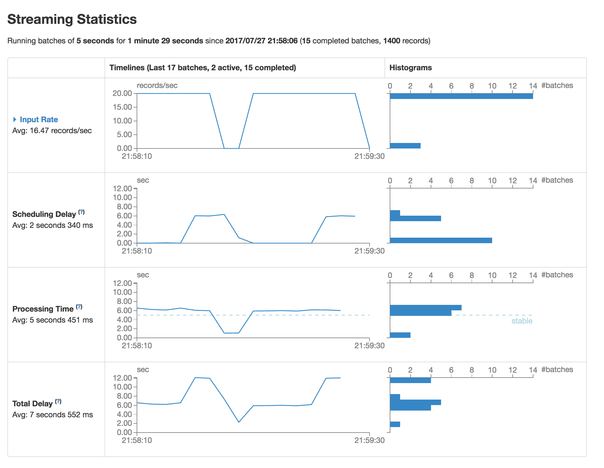

spark-http-stream
==================

The following example shows Spark streaming application, which reads
from HTTP sources periodically, and processes downloaded content.

The input stream adapts automatically to the processing rate due to
Spark streaming backpressure feature. The feature can be seen in action on this picture:

## Building

To build Spark application jar, run:

    ~$ mvn package
    
## Running

First, run some dummy multi-threaded Web server that listens on port 8000.

Then, submit the application jar using the following command:
 
    ~$ spark-submit --class com.github.spektom.spark.TestJob target/spark-http-stream_2.11-0.0.1.jar
    
To view Spark streaming statistics, open this URL in your browser: [http://localhost:4040/streaming](http://localhost:4040/streaming)
